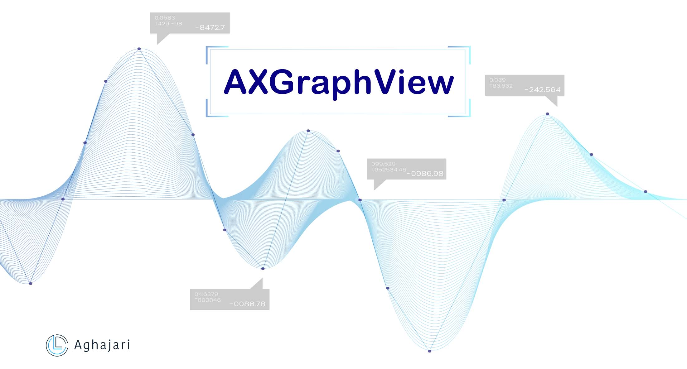
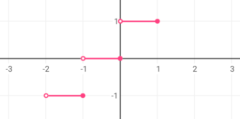
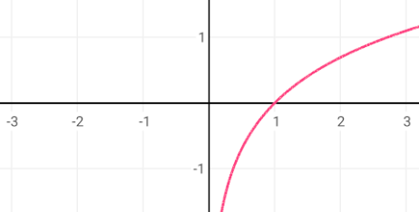
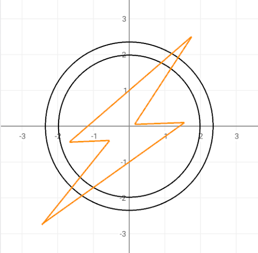

# AXGraphView


[](http://developer.android.com/index.html)
[](https://android-arsenal.com/api?level=16)
[](https://search.maven.org/artifact/io.github.aghajari/AXGraphView/1.1.0/aar)
[](https://gitter.im/Aghajari/community?utm_source=badge&utm_medium=badge&utm_campaign=pr-badge&utm_content=badge)

 **AXGraphView** creates zoomable and scrollable graphs.

## Screenshot

<div align="center">


</div>

## Preview (GIF)


## Table of Contents  
- [Installation](#installation)  
- [Quick Start](#quick-start)
- [FormulaParser](#formulaparser)
- [Graph Axis](#graph-axis)
- [Domain of Graph](#domain-of-graph)
- [Custom Points](#custom-points)
- [Transform](#transform)
- [MultiFormula](#multiformula)
- [Custom Draw](#custom-draw)
- [Famous Graphs](#famous-graphs)
- [Multi Formula Graphs](#multi-formula-graphs)
- [Author](#author)
- [License](#license)

## Installation
AXGraphView is available in the `mavenCentral()`, so you just need to add it as a dependency (Module gradle)

Gradle
```gradle
implementation 'io.github.aghajari:AXGraphView:1.1.0'
```

Maven
```xml
<dependency>
  <groupId>io.github.aghajari</groupId>
  <artifactId>AXGraphView</artifactId>
  <version>1.1.0</version>
  <type>pom</type>
</dependency>
```

# Quick Start

1. Add view to your layout :
```xml
<com.aghajari.graphview.AXGraphView
    android:id="@+id/graph_view"
    android:background="@android:color/white"
    android:layout_width="match_parent"
    android:layout_height="match_parent"/>
```

2. Set Graph Options
```java
AXGraphView graphView = findViewById(R.id.graph_view);
AXGraphOptions options = new AXGraphOptions(this);

options.scrollEnabled = true;
options.xDividerIntervalInPx = 100;
options.xDividerInterval = 0.5f;
options.yDividerIntervalInPx = 100;
options.yDividerInterval = 0.5f;
options.maxZoom = 6f;
options.minZoom = 0.5f
options.drawAxis = true;
...

graphView.setGraphOptions(options);
```

3. Add Graph Formula
```java
graphView.addFormula(new AXGraphFormula() { // x^2
    @Override
    public float function(float x) {
        return (float) Math.pow(x,2);
    }
});

graphView.addFormula(new AXGraphFormula() { 
    @Override
    public float function(float x) { // x^3
        return (float) Math.pow(x,3);
    }
});
```

Or simply use Graph Formula Parser :
```java
graphView.addFormula(new GraphFormulaParser(this,"(x)^2"));
graphView.addFormula(new GraphFormulaParser(this,"(x)^3"));
```

## FormulaParser 
Currently i'm using this [Eval Method](https://stackoverflow.com/a/26227947) for parsing a formula in sample of AXGraphView, you can also use other libraries to parse the formula and draw it in AXGraphView.

## Graph Axis

- Change Axis Position :
You can change the default axis position in options.


```java
options.axis = new PointF(-300,AXGraphOptions.DEFAULT);
```

- Disable drawing Axis and grid lines :
```java
options.drawAxisX = false;
options.drawAxisY = false;
options.drawGridXLines = false;
options.drawGridYLines = false;
options.drawAxisXDivider = false;
options.drawAxisYDivider = false;
options.drawXText = false;
options.drawYText = false;
```

- Change axis color :
```java
options.axisPaint.setColor(Color.RED);
options.textPaint.setColor(Color.RED);
options.gridLinePaint.setColor(Color.GRAY);
```

## Domain of Graph
You can limit domain of the Graph.


```java
graphView.addFormula(new AXGraphFormula() { // x^2
    @Override
    public float function(float x) {
        return (float) Math.pow(x,2);
    }
    
    @Override
    public boolean isInDomain(float x) {
        return Math.abs(x) < 1;
    }
});
```

## Custom Points
You can customize an Specific Point in Graph.

```java
graphView.addFormula(new AXGraphFormula() { // Sin(x)

    @Override
    protected void init() {
        super.init();
        addCustomFunctionPoint(1);
        addCustomFunctionPoint(-1);
        addCustomPoint(0,3);
    }
    
    @Override
    public float function(float x) {
        return (float) Math.sin(x);
    }
    
    @Override
    public AXGraphPointType getPointType(float x, float y) {
        if (x==0) return AXGraphPointType.EMPTY;
        return super.getPointType(x, y);
    }
});
```

## Transform
You can move(x&y) or change scale(x&y) of the function on graph!

```java
formula.applyTransformMove(3f,2.5f);
formula.applyTransformScale(1.5f,1.5f);
```

## MultiFormula
You can also draw multi functions together.

```java
public class HeartGraphFormula extends AXGraphMultiFormula {

@Override
    public float[] multiFunction(float x) {
        return new float[] {
                function1(x),
                function2(x)
        };
    }

    public float function1(float x) {
        return (float) Math.sqrt(1 - Math.pow(Math.abs(x) - 1,2));
    }

    public float function2(float x) {
        return (float) (Math.acos(1 - Math.abs(x)) - Math.PI);
    }
}
```

Output :


## Custom Draw
You can draw custom shapes using AXGraphCanvas (by graph x,y) :


<details><summary><b>CircleGraphFormula (click to expand)</b></summary>
<p>
  
````java
public class CircleGraphFormula extends PaintedGraphFormula {

    private float r;
    private int angle;
    Paint paint;

    public CircleGraphFormula(Context context,float r,int angle){
        super(context);
        this.r = r;
        this.angle = angle;
        paint = new Paint();

        getGraphPaint().setStyle(Paint.Style.STROKE);
        getPointPaint().setColor(getGraphPaint().getColor());
        setPointCircleRadius(getPointCircleRadius()*1.2f);

        addCustomPoint(0,r);
        addCustomPoint(0,-r);
        addCustomPoint(r,0);
        addCustomPoint(-r,0);
    }

    @Override
    protected boolean onDraw(AXGraphCanvas canvas) {
        canvas.setRadiusFromAxis(true);
        canvas.drawCircle(0,0,r, getGraphPaint());

        if (angle!=0) {
            float angleR = (float) Math.toRadians(angle);
            String text = angle+"°";

            paint.setColor(Color.parseColor("#03DAC5"));
            paint.setStrokeWidth(getGraphPaint().getStrokeWidth());
            final float x = (float) Math.cos(angleR) * r;
            final float y = (float) Math.sin(angleR) * r;

            float r2 = r/5;
            paint.setStyle(Paint.Style.STROKE);
            canvas.drawArc(-r2,-r2,r2,r2,-angle,angle,true,paint);

            paint.setStyle(Paint.Style.FILL);
            paint.setTextSize(canvas.findGraphX(r)/10);
            canvas.drawText(text,r2,r2/1.5f, Gravity.CENTER_VERTICAL|Gravity.LEFT,paint);

            canvas.drawLine(0,0,x,0,paint);
            paint.setPathEffect(new DashPathEffect(new float[] {20f/canvas.getGraphScale(),20f/canvas.getGraphScale()}, 0f));
            canvas.drawLine(x,y,x,0,paint);
            canvas.drawLine(0,y,x,y,paint);
            paint.setPathEffect(null);

            paint.setColor(canvas.getGraphView().getContext().getResources().getColor(R.color.colorPrimary));
            canvas.drawLine(0,0,x,y,paint);

            int savedColor = getPointPaint().getColor();
            getPointPaint().setColor(paint.getColor());
            drawPoint(canvas,x,y, AXGraphPointType.CUSTOM);
            getPointPaint().setColor(savedColor);
        }
        return true; //skip drawing function
    }

    @Override
    public float function(float x) {
        return Float.POSITIVE_INFINITY; //undefined
    }
}
````
</p></details>

## Famous Graphs

|Name|Formula|AXGraphView|
| :----: | :----: | :----: |
|Quadratic|x^2||
|Cubic|x^3||
|Quadratic And Cubic|x^2 , x^3||
|Homographic|1/x||
|Square|√x||
|Cubic Root|3√x||
|Cubic Root|3√(x^2)||
|Bracket|[x]||
|Absolute Value|\|x\|||
|\|x+1\| - \|x-1\||\|x+1\| - \|x-1\|||
|Exponential|2^x||
|Logarithm|log(x)||
|Sine|sin(x)||
|Cosine|cos(x)||
|Sine And Cosine|sin(x) , cos(x)||
|Tangent|tan(x)||
|Cotangent|cot(x)||
|Tangent And Cotangent|tan(x) , cot(x)||

## Multi Formula Graphs

|Name|AXGraphView|
| :----: | :----: |
|Heart||
|Captain America||
|Superman||
|Batman||
|The Flash||
|Wonder Woman||

## Author 
- **Amir Hossein Aghajari**

License
=======

    Copyright 2021 Amir Hossein Aghajari
    Licensed under the Apache License, Version 2.0 (the "License");
    you may not use this file except in compliance with the License.
    You may obtain a copy of the License at

       http://www.apache.org/licenses/LICENSE-2.0

    Unless required by applicable law or agreed to in writing, software
    distributed under the License is distributed on an "AS IS" BASIS,
    WITHOUT WARRANTIES OR CONDITIONS OF ANY KIND, either express or implied.
    See the License for the specific language governing permissions and
    limitations under the License.


<br><br>
<div align="center">
  
  <br><a>Amir Hossein Aghajari</a> • <a href="mailto:amirhossein.aghajari.82@gmail.com">Email</a> • <a href="https://github.com/Aghajari">GitHub</a>
</div>

